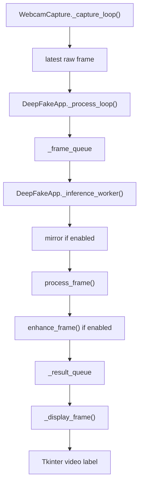

# AI Repo Guide: DeepFake Realtime

Tài liệu này dành cho AI/engineer mới vào repo và cần hiểu nhanh:

- Dự án dùng gì
- App khởi động ra sao
- Frame đi qua những bước nào
- Toggle nào đổi nhánh logic nào
- Model/GPU fallback hoạt động thế nào
- Test đang kiểm tra gì và chưa kiểm tra gì

Tài liệu này mô tả **trạng thái code hiện tại trong working tree** của `D:\DeepFake_realtime`, không giả định theo tài liệu cũ.

## 1. Mục tiêu dự án

Đây là app Python desktop chạy realtime face swap từ webcam:

- người dùng chọn 1 ảnh nguồn
- app lấy 1 khuôn mặt từ ảnh nguồn
- app đọc frame webcam liên tục
- app phát hiện hoặc track khuôn mặt trên webcam
- app dùng `inswapper` để thay mặt
- app có thể chạy thêm enhancer để làm nét
- app hiển thị kết quả trực tiếp trên UI

Stack chính:

- Python
- OpenCV
- InsightFace
- ONNX Runtime
- Tkinter + PIL

Lưu ý:

- `requirements.txt` vẫn có `customtkinter`, nhưng code UI hiện tại đang dùng `tkinter` thường, không thấy import `customtkinter` trong flow chính.
- repo không có `pyproject.toml` hay `package.json`; đây là Python app chạy trực tiếp bằng `main.py`.

## 2. Cấu trúc repo

```text
config/   cấu hình runtime, preset, metadata, trạng thái backend
core/     pipeline AI chính: detect, tracking, swap, mask, enhance, model loading
stream/   đọc webcam bằng luồng riêng
ui/       cửa sổ chính, event handlers, queue giữa UI và inference
utils/    helper FPS và image
tests/    unit tests cho logic nhỏ/pure functions
models/   chỗ đặt model .onnx, không commit model nặng vào Git
main.py   entrypoint
```

File quan trọng nhất để đọc theo thứ tự:

1. `README.md`
2. `main.py`
3. `config/globals.py`
4. `ui/app_window.py`
5. `stream/web_cam.py`
6. `core/model_loader.py`
7. `core/face_analyzer.py`
8. `core/face_swapper.py`
9. `core/face_enhancer.py`
10. `core/face_masking.py`

## 3. Cách chạy thực tế

Theo `README.md`, flow setup là:

```powershell
python -m venv .venv
.venv\Scripts\activate
pip install --upgrade pip
pip install -r requirements.txt
.venv\Scripts\python.exe main.py
```

Theo tài liệu gốc, app còn phụ thuộc model ngoài repo trong `models/`:

- `models\inswapper_128.onnx`
- `models\gfpgan-1024.onnx`
- `models\GPEN-BFR-256.onnx`
- `models\GPEN-BFR-512.onnx`

Nếu user bật FP16 swapper, app còn có thể ưu tiên:

- `models\inswapper_128_fp16.onnx`

Ngoài ra `insightface.app.FaceAnalysis(name="buffalo_l")` có thể cần Internet ở lần đầu để tải cache model `buffalo_l`.

### 3.1 Trạng thái workspace hiện tại

Trong workspace đang mở lúc tài liệu này được viết, thư mục `models/` thực tế đã có sẵn:

- `inswapper_128.onnx`
- `inswapper_128_fp16.onnx`
- `gfpgan-1024.onnx`
- `GPEN-BFR-256.onnx`
- `GPEN-BFR-512.onnx`

Nghĩa là:

- README gốc mô tả onboarding từ repo sạch
- nhưng workspace hiện tại không còn là trạng thái “chưa có model”
- AI khác không nên mặc định `models/` đang rỗng khi làm việc trong checkout này

## 4. Luồng khởi động tổng thể

Điểm vào là `main.py`.

`main()` làm 3 việc chính:

1. Gọi `setup_cuda_path()`
2. Gọi `get_execution_providers()` rồi ghi kết quả vào `config.globals.execution_providers`
3. Khởi tạo `DeepFakeApp()` rồi `run()`

Ý quan trọng:

- app **không load model ngay lúc startup**
- model chỉ load khi user bắt đầu chạm vào flow thực tế
- đây là lazy loading để mở UI nhanh hơn

### 4.1 `setup_cuda_path()`

Hàm này:

- thêm project root vào `PATH`
- dò `site-packages\nvidia\*\bin`
- thêm các thư mục DLL CUDA/cuDNN vào `PATH`
- nếu có thể thì gọi `os.add_dll_directory(...)`
- gọi `onnxruntime.preload_dlls(directory="")`

Mục tiêu: tránh lỗi thiếu DLL khi ONNX Runtime tạo CUDA/TensorRT session trên Windows.

### 4.2 Phát hiện backend

`main.py` import `core.model_loader.get_execution_providers()`.

Hàm này:

- đọc `onnxruntime.get_available_providers()`
- nếu có TensorRT và thật sự có `nvinfer*.dll` trên `PATH` thì ưu tiên `TensorrtExecutionProvider`
- sau đó ưu tiên `CUDAExecutionProvider`
- rồi `DmlExecutionProvider`
- luôn thêm `CPUExecutionProvider`

Kết quả này là **backend dự kiến** lúc startup, chưa chắc là backend runtime thực tế của từng model.

## 5. Kiến trúc runtime thật

Khi app đang live, thực tế có **3 luồng**:

1. UI thread: `Tk.mainloop()`
2. Webcam capture thread: nằm trong `stream/web_cam.py`
3. Inference thread: `_inference_worker()` trong `ui/app_window.py`

Lưu ý:

- comment trong `config/globals.py` vẫn mô tả 2 luồng
- nhưng implementation hiện tại là 3 luồng

### 5.1 Shared state

`config/globals.py` là shared state giữa UI và pipeline AI.

Biến quan trọng:

- `source_path`
- `webcam_active`
- `enable_swapper`
- `enable_enhancer`
- `enhancement_strength`
- `enhancer_model`
- `enable_masking`
- `use_fp16_inswapper`
- `many_faces`
- `live_mirror`
- `quality_preset`
- `webcam_width`
- `webcam_height`
- `webcam_fps`
- `execution_providers`
- `runtime_providers`
- `opacity`
- `mouth_mask`
- `mouth_mask_size`

Preset mặc định được áp ngay khi import globals:

- `DEFAULT_PRESET_KEY = "balanced"`

Nghĩa là nếu chưa có thao tác nào từ user, runtime ban đầu mặc định:

- `960x540`
- `30 FPS`
- enhancer tắt
- model enhancer mặc định `GPEN-BFR-256.onnx`

## 6. DeepFakeApp hoạt động ra sao

Class chính là `DeepFakeApp` trong `ui/app_window.py`.

### 6.1 Trạng thái nội bộ của app

Trong `__init__`, app tạo:

- `self.root = tk.Tk()`
- `self._webcam = WebcamCapture()`
- `self._fps_counter = FPSCounter()`
- `self._source_face`
- `self._source_image`
- `self._is_processing`
- `self._runtime_signature`
- `self._frame_queue = queue.Queue(maxsize=2)`
- `self._result_queue = queue.Queue(maxsize=2)`
- `self._inference_thread`

`maxsize=2` là quyết định quan trọng:

- app ưu tiên bỏ frame cũ khi chậm
- mục tiêu là giảm lag cảm nhận
- không cố giữ đủ mọi frame

### 6.2 UI layout

UI có 3 vùng chính:

- header: tên app, version, status, nút thoát
- sidebar: chọn ảnh nguồn, preset webcam, backend label, FPS, toggle AI
- video panel: chỗ hiển thị webcam đã xử lý

Hotkeys:

- `Esc`: dừng khẩn cấp
- `Ctrl+Q`: thoát app
- `Ctrl+W`: bật/tắt webcam

## 7. Luồng thao tác người dùng

### 7.1 Chọn ảnh nguồn

Flow:

1. `_select_source()` mở file dialog
2. `cv2.imread(path)` đọc ảnh
3. `globals.source_path = path`
4. `get_one_face(img)` tìm mặt nguồn
5. nếu không có mặt:
   - status báo lỗi/cảnh báo
   - không set `_source_face`
6. nếu có mặt:
   - lưu `self._source_face`
   - lưu `self._source_image`
   - render preview ảnh nguồn trên UI

Điểm cần nhớ:

- app chỉ dùng **1 face từ ảnh nguồn**
- face được chọn là face nằm bên trái nhất (`min(f.bbox[0])`)
- không phải face lớn nhất hay rõ nhất

### 7.2 Bật webcam

Flow:

1. `_toggle_webcam()` gọi `_start_webcam()`
2. `_start_webcam()` chặn nếu chưa có `_source_face`
3. `self._webcam.start(width, height, fps)` mở camera
4. set `globals.webcam_active = True`
5. set `self._is_processing = True`
6. clear `frame_queue` và `result_queue`
7. spawn `self._inference_thread`
8. gọi `_process_loop()` trên UI thread

Nếu mở webcam thất bại:

- update status màu đỏ
- không start pipeline AI

## 8. Đường đi của 1 frame

Đây là flow quan trọng nhất của toàn repo.



### 8.1 Capture layer

`stream/web_cam.py` mở camera bằng:

- thử `cv2.CAP_DSHOW` trước
- nếu fail thì fallback sang backend mặc định

Nó cấu hình:

- width
- height
- fps
- `CAP_PROP_BUFFERSIZE = 1`

Sau đó thread `_capture_loop()` chạy liên tục:

- `cap.read()`
- nếu có frame thì cập nhật `self._current_frame` dưới lock
- UI luôn chỉ lấy **frame mới nhất**

Điểm quan trọng:

- capture thread không đẩy queue trực tiếp
- nó chỉ giữ snapshot frame mới nhất

### 8.2 UI polling loop

`_process_loop()` chạy bằng `root.after(10, ...)`.

Mỗi vòng:

1. gọi `self._webcam.read()`
2. nếu có frame và `_frame_queue` chưa full thì đẩy vào queue
3. cố lấy kết quả mới từ `_result_queue`
4. nếu có kết quả:
   - `_display_frame(res_frame)`
   - sync backend label nếu runtime providers đổi
   - `FPSCounter.tick()`
   - tính FPS trung bình và đổi màu FPS label
5. tự schedule lại sau 10ms

### 8.3 Inference worker

`_inference_worker()` là nơi AI xử lý thật.

Mỗi frame lấy từ `_frame_queue` sẽ đi qua:

1. mirror nếu `globals.live_mirror`
2. swap nếu `globals.enable_swapper` và đã có source face
3. enhance nếu `globals.enable_enhancer`
4. nếu `_result_queue` full thì bỏ kết quả cũ
5. đẩy kết quả mới nhất sang `_result_queue`

Đây là thiết kế kiểu:

- UI không bị block bởi AI
- nếu AI chậm thì app vẫn cố giữ độ responsive
- tradeoff: có thể drop frame

## 9. Pipeline AI chi tiết

## 9.1 Face analyzer

File: `core/face_analyzer.py`

Vai trò:

- detect mặt
- lấy embedding nhận diện
- lấy landmark 5 điểm và 106 điểm
- hỗ trợ tracking để giảm detect cost

### `get_face_analyser()`

Singleton + double-check locking.

Nó tạo:

- `insightface.app.FaceAnalysis(name="buffalo_l")`
- `allowed_modules=["detection", "recognition", "landmark_2d_106"]`
- `prepare(ctx_id=0, det_size=(320, 320))`

Ý nghĩa:

- chỉ load đúng module cần dùng
- `det_size=(320,320)` ưu tiên tốc độ hơn độ chính xác tuyệt đối

Model này cũng đi qua `load_with_provider_fallback()`, nên nó có thể:

- thử TensorRT
- rồi CUDA
- rồi CPU

### `get_one_face(frame)`

Detect tất cả mặt rồi chọn mặt có `bbox[0]` nhỏ nhất.

Hệ quả:

- nếu ảnh nguồn có nhiều người, app chọn người ở bên trái
- heuristic này đơn giản, không có UI để user chọn face cụ thể

### `get_many_faces(frame)`

Detect tất cả mặt.

Nếu detect lỗi:

- swallow exception
- trả `[]`

### FaceTracker

Khi `many_faces=False`, app không detect lại mỗi frame.

`FaceTracker.update(frame, analyzer_func)`:

- nếu chưa có tracker hoặc quá `detect_interval=15` frame thì detect lại
- nếu tracker còn sống thì update bbox
- nó nội suy `kps` theo scale + offset của bbox mới

Fallback tracker:

- ưu tiên `TrackerMOSSE`
- rồi `TrackerKCF`
- rồi `TrackerCSRT`
- thử cả `cv2.*` và `cv2.legacy.*`
- nếu không có tracker nào, app fallback sang detect mỗi frame

Nuance quan trọng:

- tracker chỉ cập nhật `bbox` và `kps`
- nó **không refresh `landmark_2d_106` mỗi frame**
- nếu `enable_masking` hoặc `mouth_mask` bật, mask ở các frame giữa 2 lần detect có thể dựa trên landmark 106 cũ

## 9.2 Face swapper

File: `core/face_swapper.py`

Đây là lõi quan trọng nhất.

### Chọn model inswapper

`resolve_inswapper_model_path(models_dir)`:

- nếu `use_fp16_inswapper=True`:
  - ưu tiên `inswapper_128_fp16.onnx`
  - fallback `inswapper_128.onnx`
- nếu `False`:
  - ưu tiên `inswapper_128.onnx`
  - fallback `inswapper_128_fp16.onnx`

### Lazy load swapper

`get_face_swapper()` là singleton có lock.

Nó gọi:

- `insightface.model_zoo.get_model(model_path, providers=providers)`

rồi đi qua `load_with_provider_fallback()`.

### `reload_face_swapper()`

UI gọi hàm này khi user bật/tắt FP16.

Nó chỉ:

- reset cache `_FACE_SWAPPER = None`

Lần swap kế tiếp mới load model mới.

### `process_frame(source_face, frame)`

Đây là router giữa 2 mode:

- `many_faces=True`:
  - `get_many_faces(frame)`
  - loop từng face
  - mỗi face gọi `swap_face(...)`
- `many_faces=False`:
  - `_global_tracker.update(frame, get_one_face)`
  - nếu có target face thì swap 1 mặt

### `swap_face(source_face, target_face, frame)`

Per-face pipeline:

1. đảm bảo `frame` là `uint8` và contiguous
2. gọi `swapper.get(frame, target_face, source_face, paste_back=False)`
3. nhận:
   - `swapped_face_128`
   - `affine_M`
4. gọi `face_align.norm_crop2(...)` để lấy `aligned_img`
5. gọi `_paste_back_optimized(...)` để dán ngược lên frame gốc
6. nếu `enable_masking`:
   - `create_face_mask(target_face, frame)`
   - `_apply_face_mask_blend(frame, result, face_mask)`
7. nếu `mouth_mask`:
   - `create_mouth_mask(target_face, frame)`
   - `_restore_original_mouth(...)`
8. nếu `opacity < 1.0`:
   - blend lại với frame gốc bằng `cv2.addWeighted`

Nếu có exception:

- log `[FACE-SWAPPER]`
- trả frame gốc

### `_paste_back_optimized(...)`

Hàm này làm 6 việc:

1. invert affine matrix
2. warp face swap và mask về hệ tọa độ frame gốc
3. tìm ROI thật sự của vùng mặt
4. tính erosion/blur kernel theo size mặt
5. chỉ xử lý trên ROI thay vì full frame
6. alpha blend fake crop với real crop

Ý nghĩa:

- giảm cost
- giảm viền cứng
- tránh blend cả full frame

## 9.3 Face masking

File: `core/face_masking.py`

### `create_face_mask(face, frame)`

Flow:

1. lấy `landmark_2d_106`
2. lấy 33 điểm outline đầu
3. `cv2.convexHull(...)`
4. pad ra ngoài khoảng 5%
5. fill polygon trắng
6. Gaussian blur

Kết quả:

- mask grayscale 2D
- chỉ vùng mặt được giữ lại sau swap

Mục tiêu:

- giảm đè lên tóc, kính, tay che mặt

### `create_mouth_mask(face, frame)`

Flow:

1. lấy landmark miệng `52:72`
2. tính center
3. scale theo `mouth_mask_size`
4. tính bounding box + padding
5. fill polygon trong ROI
6. blur mềm
7. cắt `mouth_cutout` từ frame gốc

Kết quả trả về:

- `mask`
- `mouth_cutout`
- `mouth_box`
- `polygon`

Mục tiêu:

- giữ nguyên biểu cảm miệng thật
- giảm cảm giác miệng “đóng băng” sau swap

## 9.4 Face enhancer

File: `core/face_enhancer.py`

Enhancer chạy **sau swap**.

### Lazy load enhancer

`get_face_enhancer()`:

- đọc `globals.enhancer_model`
- build `onnxruntime.InferenceSession(...)`
- dùng `GraphOptimizationLevel.ORT_ENABLE_ALL`
- đi qua `load_with_provider_fallback()`

Cache enhancer phụ thuộc:

- instance session
- tên model đang dùng

Nghĩa là đổi dropdown model trên UI không reload ngay lúc click, mà reload khi `enhance_frame()` chạy lần tiếp theo.

### `enhance_frame(frame)`

Per-frame flow:

1. load session nếu cần
2. lấy `input_name`
3. suy ra `align_size` từ input shape, fallback `512`
4. `get_many_faces(frame)`
5. loop từng face
6. nếu face có `kps` hợp lệ:
   - `_align_face(...)`
   - `_preprocess(...)`
   - `session.run(...)`
   - `_postprocess(...)`
   - resize nếu output size lệch `align_size`
   - `_paste_back(...)`

Điểm cần nhớ:

- enhancer detect lại tất cả mặt trên frame đã swap
- enhancer không chỉ xử lý face vừa swap
- nếu nhiều mặt, enhancer sẽ thử enhance tất cả mặt detect được

### `_paste_back(...)` trong enhancer

Khác swapper:

- dùng ellipse mask mềm
- blur lớn
- nhân với `enhancement_strength`

Mục tiêu:

- giữ hiệu ứng enhancer tự nhiên hơn
- tránh mặt bị “giả” quá mức

## 10. Backend và fallback model

File quan trọng: `core/model_loader.py`

### `build_provider_fallback_chain()`

Nó tạo chuỗi attempt như sau:

1. TensorRT config nếu khả dụng
2. CUDA config
3. CPU only

### `load_with_provider_fallback(loader, provider_attempts, model_name)`

Đây là helper chung cho hầu hết model.

Flow:

1. thử từng cấu hình provider
2. nếu thành công:
   - lấy runtime providers thật bằng `_extract_runtime_providers(...)`
   - ghi vào `globals.runtime_providers[model_name]`
   - log provider thật ra console
   - return model/session
3. nếu fail:
   - log lỗi
   - thử attempt tiếp theo
4. nếu fail hết:
   - raise lỗi cuối

Đây là lý do UI có 2 kiểu label backend:

- backend dự kiến từ `execution_providers`
- backend runtime thật từ `runtime_providers`

### `describe_backend()` và `describe_runtime_backend()`

`config/backend_status.py` chỉ làm mapping label màu:

- CUDA -> xanh
- DirectML/mixed -> vàng
- CPU -> đỏ

## 11. Preset và toggle ảnh hưởng logic thế nào

### Preset

Định nghĩa trong `config/performance_presets.py`:

- `smooth`
- `balanced`
- `quality`

Khác nhau ở:

- webcam resolution
- webcam FPS
- bật/tắt enhancer mặc định
- model enhancer
- strength enhancer

Hiện tại:

- `smooth`: `640x480`, 30 FPS, enhancer off
- `balanced`: `960x540`, 30 FPS, enhancer off
- `quality`: `960x540`, 24 FPS, enhancer on, `gfpgan-1024.onnx`

Khi user đổi preset trong UI:

1. `apply_preset(globals, key)`
2. sync UI controls
3. nếu webcam đang chạy thì stop rồi start lại

### Toggle map

`enable_enhancer`

- được set bởi checkbox UI
- worker sẽ gọi `enhance_frame()` sau `process_frame()`

`use_fp16_inswapper`

- được set bởi checkbox UI
- UI gọi `reload_face_swapper()`
- lần swap sau mới load model phù hợp

`many_faces`

- quyết định detect tất cả mặt hay tracker 1 mặt

`enable_masking`

- thêm nhánh `create_face_mask()` + `_apply_face_mask_blend()`

`mouth_mask`

- thêm nhánh `create_mouth_mask()` + `_restore_original_mouth()`

`mouth_mask_size`

- scale phạm vi ROI miệng

`live_mirror`

- worker `cv2.flip(frame, 1)` trước khi swap

`opacity`

- hiện không có control trên UI
- nhưng swapper vẫn hỗ trợ blend cuối nếu giá trị < 1.0

## 12. Utility modules

### `utils/fps_counter.py`

`FPSCounter` dùng sliding window bằng `deque`.

`get_fps()`:

- lấy timestamps trong cửa sổ
- tính `(n - 1) / time_span`

Nghĩa là FPS hiển thị ổn định hơn FPS tức thời.

### `utils/image_utils.py`

Có 3 helper:

- `resize_image(...)`
- `convert_bgr_to_rgb(...)`
- `apply_color_transfer(...)`

Quan sát:

- flow UI/runtime hiện tại hầu như không dùng module này
- `apply_color_transfer(...)` chưa thấy được gắn vào pipeline chính

## 13. Shutdown paths

App có 4 đường dừng:

`_stop_webcam()`

- tắt live bình thường
- release webcam
- join inference thread
- hủy `after` job

`_emergency_stop()`

- dừng khẩn cấp
- reset video label, FPS, status

`_on_close()`

- gọi `_stop_webcam()`
- `root.destroy()`

`_kill_app()`

- cleanup best-effort
- `os._exit(0)`

Lưu ý:

- `os._exit(0)` là hard exit
- bỏ qua cleanup Python thông thường

## 14. Test coverage hiện có

Repo có test, nhưng chủ yếu là unit test nhỏ:

- `tests/test_backend_status.py`
  - kiểm tra label backend theo provider list
- `tests/test_face_masking_integration.py`
  - kiểm tra blend mask và restore miệng
- `tests/test_face_masking_settings.py`
  - kiểm tra mapping `mouth_mask_size -> expansion`
- `tests/test_face_swapper_model_selection.py`
  - kiểm tra chọn file inswapper
- `tests/test_model_loader_fallback.py`
  - kiểm tra loader fallback trả result đúng hoặc raise lỗi cuối
- `tests/test_performance_presets.py`
  - kiểm tra preset mặc định và `apply_preset(...)`

### 14.1 Kết quả test đã xác minh

Đã chạy:

```powershell
.\.venv\Scripts\python.exe -m pytest tests -q -o cache_dir="$env:TEMP\deepfake_pytest_cache"
```

Kết quả quan sát được:

- `13 passed`
- `1 failed`

Test đang fail:

- `tests/test_face_swapper_model_selection.py::FaceSwapperModelSelectionTests::test_rejects_fp16_only_model`

Lý do fail:

- test kỳ vọng nếu chỉ có `inswapper_128_fp16.onnx` thì phải `FileNotFoundError`
- code hiện tại trong `resolve_inswapper_model_path(...)` lại cho fallback sang FP16 ngay cả khi `use_fp16_inswapper=False`

Diễn giải đúng:

- code runtime hiện tại cho phép dùng FP16-only như fallback
- test đang giữ kỳ vọng cũ hơn implementation hiện tại

Điều test hiện **chưa** cover:

- chạy webcam thật
- UI event loop
- queue giữa UI và inference
- tracking thực tế
- load model ONNX thật
- InsightFace runtime thật
- GPU/TensorRT/DirectML runtime
- end-to-end từ chọn ảnh tới render frame

Nghĩa là:

- confidence tốt với helper logic nhỏ
- confidence thấp hơn với runtime integration thật

## 15. Chỗ tài liệu và code đang lệch nhau

Đây là phần quan trọng để AI khác không bị dẫn sai:

### Lệch 1: README nói `customtkinter`

`README.md` và `requirements.txt` còn nhắc `customtkinter`, nhưng UI hiện tại đang viết bằng `tkinter` thường.

### Lệch 2: comment globals nói 2 luồng

Implementation thực tế là 3 luồng:

- UI
- webcam capture
- inference

### Lệch 3: nhiều comment cũ chưa phản ánh toàn bộ refactor mới

Ví dụ:

- pipeline hiện có queue giữa UI và worker
- có thêm FP16 swapper toggle
- có tracking cho single-face mode
- có runtime backend label dựa trên model load thật

### Lệch 4: docs trong `models/` chưa phản ánh đầy đủ artifact hiện tại

`models/README.md` và `models/instructions.txt` hiện chỉ nhắc 4 model cơ bản.

Nhưng workspace thật đang có thêm:

- `inswapper_128_fp16.onnx`

Và docs trong `models/` cũng chưa nhắc:

- dependency `buffalo_l`
- provider fallback TensorRT/CUDA/DML/CPU
- khác biệt giữa workspace hiện tại và repo sạch

### Lệch 5: test và code đang xung đột ở nhánh chọn model FP16

Code hiện tại:

- ưu tiên FP32 khi `use_fp16_inswapper=False`
- nhưng vẫn fallback sang FP16 nếu FP32 không có

Test cũ:

- yêu cầu trường hợp “chỉ có FP16” phải fail

Khi audit repo, nên tin code hiện tại hơn phần mô tả cũ, nhưng cũng phải ghi nhận test suite đang báo mâu thuẫn này.

## 16. Điểm mạnh của thiết kế hiện tại

- startup nhanh nhờ lazy loading
- UI không block vì AI chạy thread riêng
- queue nhỏ giúp giảm lag cảm nhận
- có fallback provider từ TensorRT/CUDA xuống CPU
- có tracking để giảm detect cost khi chỉ swap 1 mặt
- có masking/mouth restore để tăng độ tự nhiên
- enhancer được tách module rõ

## 17. Điểm yếu / tradeoff / rủi ro kỹ thuật

- chọn face nguồn theo “bên trái nhất” khá thô
- single-face mode phụ thuộc tracker; landmark 106 có thể stale giữa các lần detect
- enhancer detect lại toàn bộ mặt sau swap, tăng cost
- không có integration test runtime
- model ngoài repo làm onboarding khó hơn
- hard exit bằng `os._exit(0)` có thể bỏ qua cleanup mềm
- state dùng global module-level variables, đơn giản nhưng coupling cao

## 18. Hướng đọc repo nhanh cho AI khác

Nếu mục tiêu là sửa bug UI/live lag:

1. đọc `ui/app_window.py`
2. đọc `stream/web_cam.py`
3. đọc `utils/fps_counter.py`
4. đọc `config/globals.py`

Nếu mục tiêu là sửa chất lượng swap:

1. đọc `core/face_swapper.py`
2. đọc `core/face_masking.py`
3. đọc `core/face_analyzer.py`

Nếu mục tiêu là sửa enhancer:

1. đọc `core/face_enhancer.py`
2. đọc `config/performance_presets.py`
3. đọc `ui/app_window.py` phần toggle/model dropdown

Nếu mục tiêu là sửa GPU/backend:

1. đọc `main.py`
2. đọc `core/model_loader.py`
3. đọc `config/backend_status.py`
4. đọc `config/globals.py`

## 19. Tóm tắt ngắn gọn nhất

App này là:

- Python desktop app
- Tkinter UI
- webcam capture thread riêng
- inference thread riêng
- InsightFace để detect/recognize/landmark
- inswapper để swap
- GFPGAN/GPEN để enhance
- ONNX Runtime với fallback TensorRT/CUDA/DML/CPU
- queue nhỏ để ưu tiên frame mới nhất

Luồng chính:

1. chọn ảnh nguồn
2. trích 1 source face
3. bật webcam
4. lấy latest frame
5. mirror nếu cần
6. detect hoặc track target face
7. swap face
8. mask/mouth restore nếu bật
9. enhance nếu bật
10. render lên UI

Đây là mental model đúng nhất để AI khác bắt đầu làm việc trong repo này.
